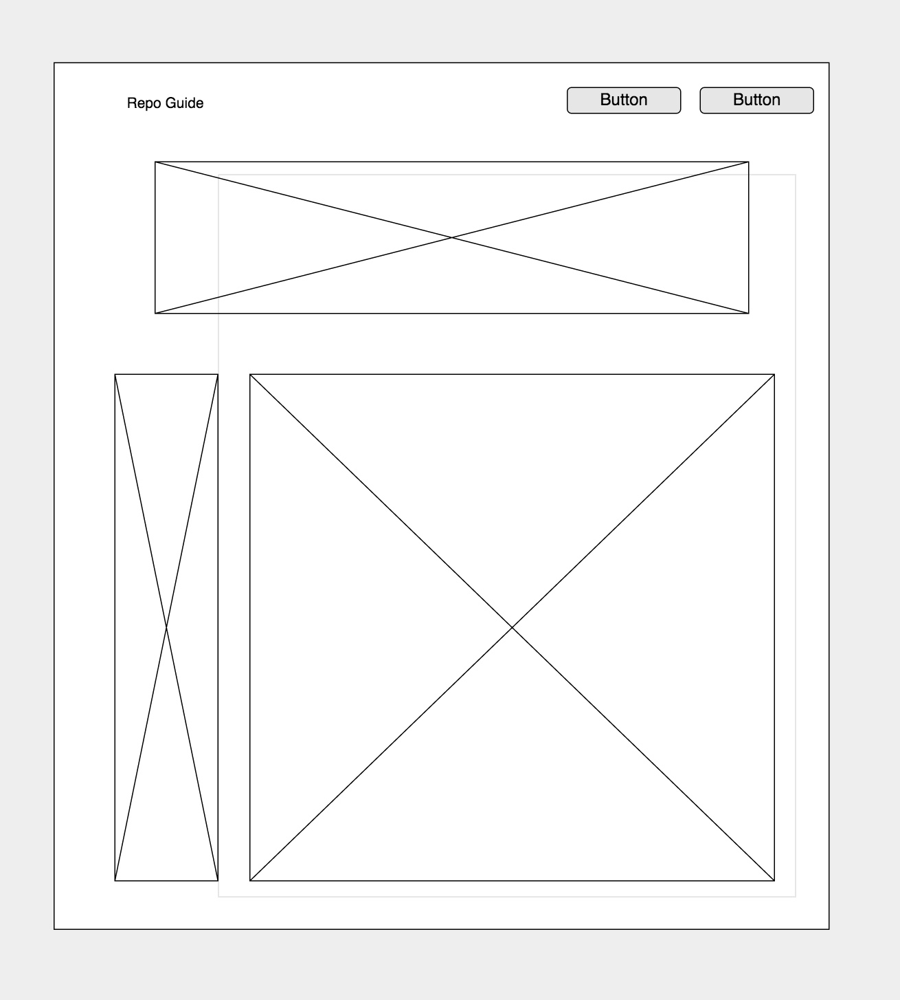

# repo-guide

A guide to your repositories.

Link to app: [Repo Guide](https://prankmode.github.io/repo-guide)

## Project Idea

I have been frustrated when looking for information in all the gabillions of repos
we have received in class.   My project is to provide an interface to look at all
our repos, tag them, and extract some information from the READMEs.

## Approach

Before the project really started, I looked into how to get a list of
repositories from my github account.  Luckily, Github provides an easy way
to get this list.  I also fooled around with writing a script to paw through
the README and generate some information like a table of contents.

#### Data tables
I needed tables for repositories and tags.  They would have a many-to-many
relationship.  The repos table has

-  the repo name
-  the description of the repo
-  the URL of the repo
-  the README table-of-contents

It was my hope to generate a table-of-contents for the README.  Not in version 1.
:-)

The tag table has a tag name and a tag type.  I was planning to generate tags
based off of the repo name and I thought I might want to know whether it was
a "system" tag or a user-created tag.  There is no use for this field at this time.

I am thinking that if I do implement a table of contents utility, maybe it
would be better to make a separate table for that textual information.  Probably
better to keep randomly bigger than a string information in a separate table?

#### Initial data

To avoid the 3rd party API in the beginning, I generated a list of repositories
in my github account using a curl command.  I then wrote a little Ruby program
to read this file and generate a seeds.db file that I could use.

#### Functionality

I think worked on implementing the repo functions, then the tags.  Then I set
up the many-to-many relationship and connected them.  Also, started work on the
client and figuring out how I would display all these things.  I used a
collapsible list.  All I can say is thank goodness for Handlebars!

After implementing functionality to allow the user to load an initial set of
repositories, I changed it to actually get them from GitHub directly.  So users
can either add repositories 1-by-1 or they can load a whole bunch.

## User stories

As a GA student sitting at the end of the firehose, I want to:
-  keep a list of repos that I want to reference
-  add repos onto my list
-  display a list of all my repos from my github account
-  be able to tell what each one was about
-  group them by subject
-  tag repos
-  delete any repo i don't care about
-  import a list of all my repos from my github account

## Wireframe

